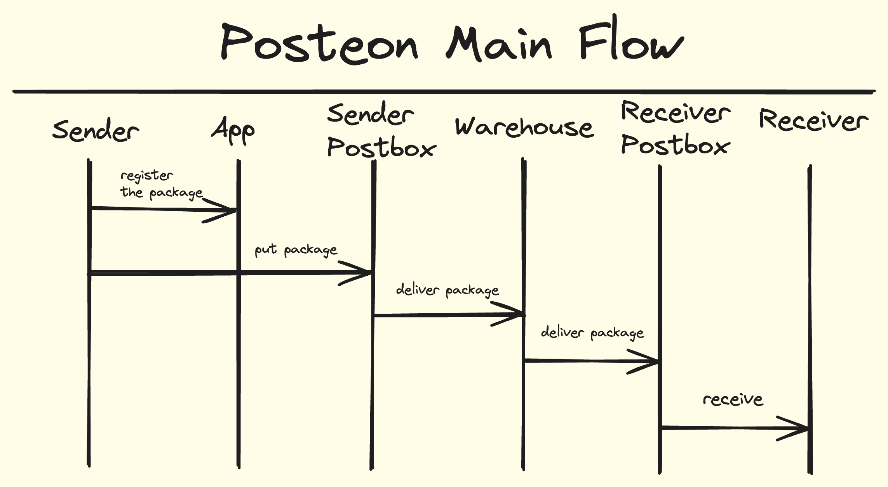

## Posteon Pet Project
Posteon is an application for postboxes backend system. This is a system represents a third party service to conveniently send packages between different, independent parties. Mainly inspired by the [InPost](https://inpost.pl/)(Poland). This works especially great, when you have a LOT of postboxes around the country. **This project is in progress**

**Posteon** consists from next entities:
1. **Sender/Receiver** - users who want to send/receive the package. The relation might be physical user/business <-> physical user/business.
2. **Postbox** - physical boxes with **postcells**. Users intends to use these postboxes to send receive packages
3. **Package** - core item in the application. Everything is built around it. Has it's size, weight, route history and etc.
4. **Warehouse** - A buffer/sorting place where all packages are stored after being picked up from the postboxes. All route planning is happening here
5. **Drivers** - people who drive special **post-trucks** for gathering and delivering packages.
6. to be continued...

### Main Flow
Anyone can register himself in the application(posteon app, out of the scope of this project). And send an appropriate package(in terms of size/weight) to any other postbox. The package is being picked up from the postbox by posteon drivers and delivered to the warehouse. Each day, the logistic job plan schedules for all packages. It assigns packages to trucks and generate an appropriate job for drivers. The job might include 1 or 2 tasks: a) delivering packages b) gathering packages from the postboxes. It depends from the truck capacity

### Tech details
The application consists from
1. Backend written with `Nest.js`
2. `PostgreSQL` as a database

To run the application you need to:
1. Run the database using `docker-compose up`
2. Install packages running `npm i`
3. Run the dev mode using `npm run start:dev`

For the internal structure it uses DDD as a paradigm. Everything organised as `modules`. Within  every module you can find all appropriate resources for the specific module(such as `entities`, `repositories`, `services`, `use-cases`) except the API layer. The API layer sits within it's own module, since it should be independent from other modules. The main idea is to separate the domain layer from the infrastructure. Then you can incorporate all business logic inside entities and aggregates. Possibly to include domain events to enable inter-aggregate communication